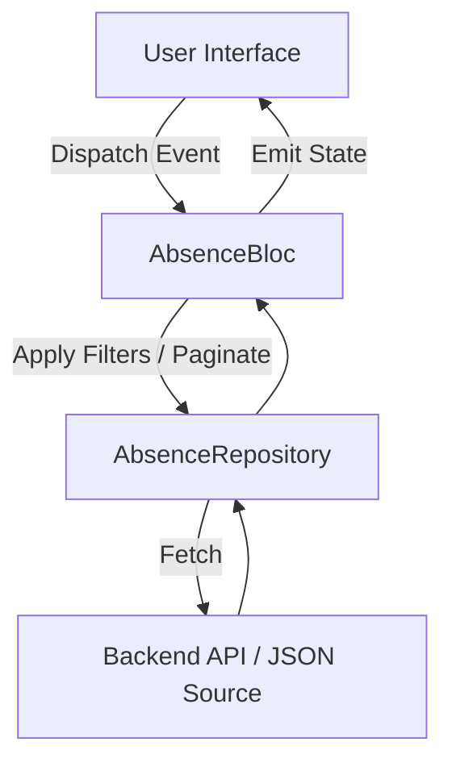

# 🏗 Architecture Overview

This document outlines the architecture of the **Absence Manager** Flutter application. The app is designed to be modular, scalable, and maintainable, following clean architecture principles and best practices in Flutter development.

---
## ⚙️ Key Technologies

| Area               | Technology / Approach                  |
|--------------------|----------------------------------------|
| State Management   | `flutter_bloc`                         |
| UI Framework       | `Flutter`                              |
| API Communication  | `http`                                 |
| Code Quality       | `flutter_lints`, `make check`, `test` |
| Testing            | `flutter_test`, unit tests for Bloc    |
| Data Source        | Express.js backend with mock JSON      |

---

## 🧱 Project Layers

The codebase is organized into three main logical layers:

### 1. **Presentation Layer**
Responsible for rendering UI components and handling user interaction.

- **Widgets**: Reusable UI building blocks (`FilterButton`, `AbsenceDataTable`, `ExportAbsencesButton`, etc.)
- **Pages**: Entry points like `AbsenceManagerScreen`, which orchestrate widget composition.
- **State Management**: Powered by `flutter_bloc` to manage UI state and business logic separation.
- **Feedback States**: Loading indicators, error messages, and empty states are handled gracefully.

### 2. **Business Logic Layer**
Handles data transformation, filtering, pagination, and state changes.

- **Bloc**: `AbsenceBloc` processes events (`LoadAbsences`, `FilterChanged`, etc.) and emits states (`AbsenceLoading`, `AbsenceLoaded`, `AbsenceError`).
- **Events/States**: Clearly defined Bloc contracts for predictable flow and easy testing.
- **Utilities**:
  - `_applyFilters()` to apply type, status, date, and employee-based filtering
  - `_paginateAbsences()` to return paginated results for display

### 3. **Data Layer**
Manages data fetching and transformation from the backend.

- **Repository Pattern**: `AbsenceRepository` abstracts API logic from Bloc and UI
- **API Integration**: REST API powered by a separate Express.js backend (see [backend README](#))
- **Local Caching**: Bloc fetches all absences once and applies filters/pagination in-memory

---

## 🔁 Data Flow Summary

The UI dispatches an event (e.g., filter applied, pagination).
The BLoC handles the event and invokes the repository.
The repository interacts with the backend API or local source (mocked JSON).
The response is processed and returned to the BLoC.
The BLoC emits the new state, updating the UI accordingly.


---

## 📦 Modularity & Reusability

- **Widgets** are split into atomic reusable components to ensure separation of concerns.
- **Filters** and **Chips** are isolated from the rest of the view.
- Business logic is testable and resides in `Bloc`.

---

## ✅ Testing Strategy

- Bloc unit tests to cover:
  - Initial load
  - Filtering logic
  - Pagination
  - Error state
  - Refetch flow
- UI can be tested using widget tests for interaction scenarios

---

## 🔄 Future Improvements

- Move filtering logic to repository or use-case layer for better testability
- Support offline-first mode with local persistence
- Migrate to `Freezed` and `Equatable` for cleaner Bloc/event/state declarations
- Modularize screens using feature-first folder structure (e.g., `features/absence/`)

---

## 📁 Folder Structure (Simplified)

```
lib/
├── blocs/
│   ├── absence_bloc.dart
│   ├── absence_event.dart
│   └── absence_state.dart
│
├── models/
│   ├── filters/
│   │   └── absence_filter_model.dart
│   ├── absence_status.dart
│   ├── absence_type.dart
│   ├── absence.dart
│   ├── member.dart
│   └── paginated_result.dart
│
├── repository/
│   ├── absence_repository_factory.dart
│   ├── absence_repository.dart
│   ├── api_absence_repository.dart
│   └── mock_absence_repository.dart
│
├── screens/
│   └── absence_screen.dart
│
├── widgets/
│   ├── filters/
│   │   ├── filter_applied_chips.dart
│   │   ├── filter_badge.dart
│   │   ├── filter_button.dart
│   │   ├── filter_date_selector.dart
│   │   ├── filter_dialog.dart
│   │   └── filter_dropdown.dart
│   ├── absence_data_table.dart
│   ├── absence_overview.dart
│   ├── error_message_widget.dart
│   ├── export_ical_button.dart
│   ├── no_absences_found.dart
│   └── page_controls.dart
│
└── main.dart

```
---

## 🔚 Summary

This architecture provides a clean separation between presentation, business logic, and data, supporting scalability, testability, and future extensibility. The `Bloc` pattern ensures predictable state transitions, while the modular widget composition supports maintainable UI growth.
